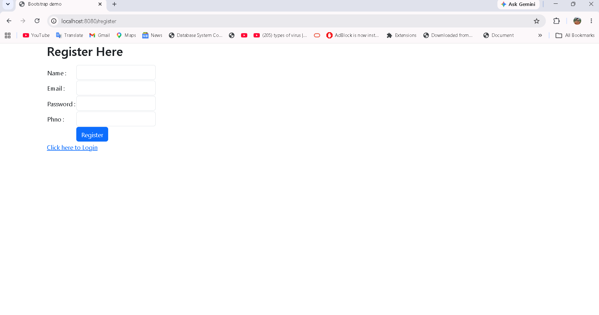
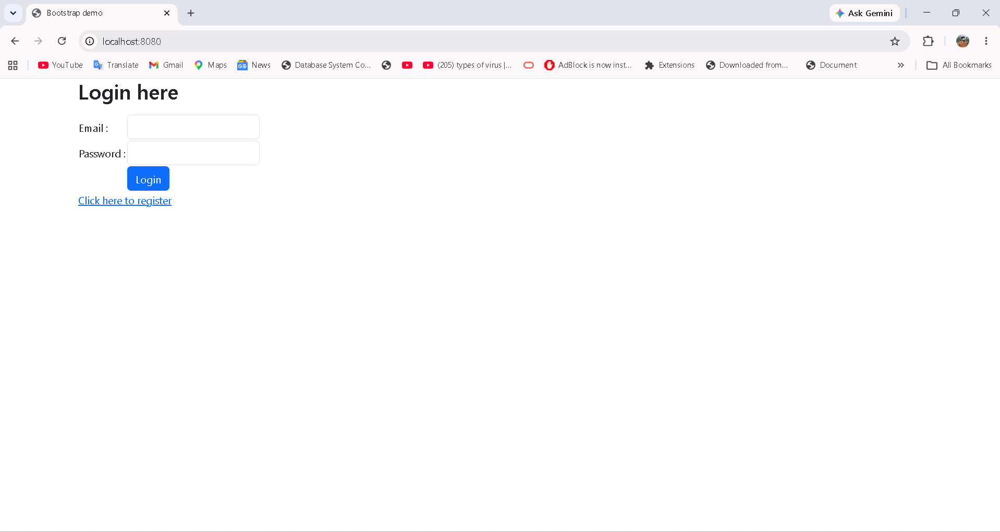
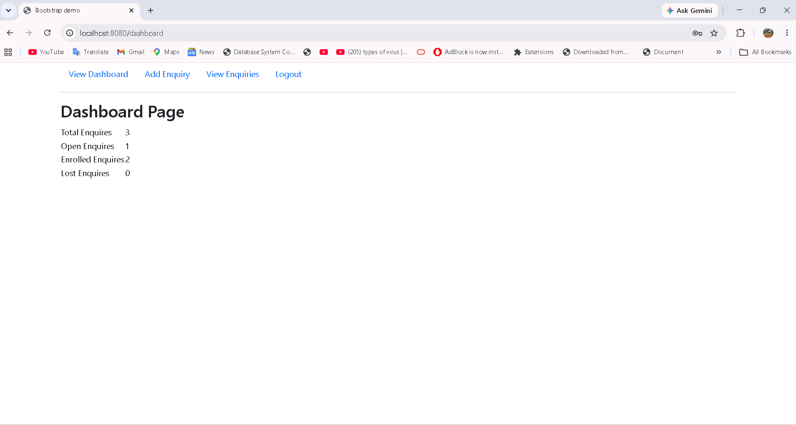
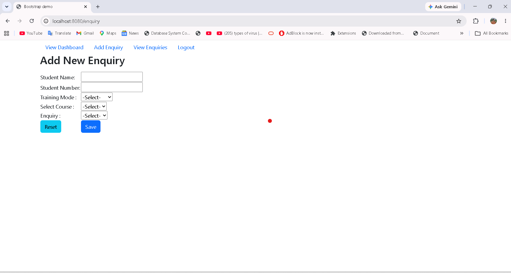
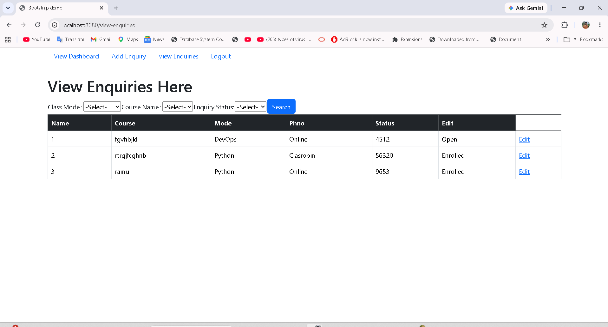

# 🎓 Counsellor Portal

> A Spring Boot web application for managing student enquiries in a training institute. It enables counsellors to register, log in, manage student enquiries, update enquiry status, and monitor their performance through an interactive dashboard.

---

# 📌 Project Overview

**Counsellor Portal** is a real-time web application built using **Java, Spring Boot, Spring MVC, Spring Data JPA, Hibernate, Thymeleaf, and MySQL**.

The application is designed to simplify the student enquiry management process in a training institute. Counsellors can securely log in, manage student enquiries, track enquiry status, and monitor their overall performance through a personalized dashboard.

This project demonstrates a complete CRUD application following the **MVC Architecture** using Spring Boot.

---

# ✨ Features

## 👤 Counsellor Management

* New Counsellor Registration
* Secure Login & Logout
* Session Management
* Personalized Dashboard

## 📋 Student Enquiry Management

* Add New Student Enquiry
* View All Enquiries
* Search & Filter Enquiries
* Update Student Enquiry
* Change Enquiry Status

  * Open
  * Enrolled
  * Lost

## 📊 Dashboard Analytics

The dashboard provides real-time statistics:

* 📁 Total Enquiries
* 🟡 Open Enquiries
* ✅ Enrolled Enquiries
* ❌ Lost Enquiries

---

# 🛠️ Tech Stack

## Backend

* Java 17
* Spring Boot
* Spring MVC
* Spring Data JPA
* Hibernate
* Maven

## Frontend

* Thymeleaf
* HTML5
* CSS3
* Bootstrap 5

## Database

* MySQL

## Tools & IDE

* Eclipse / IntelliJ IDEA
* Git
* GitHub

---

# 📂 Project Structure

```text
Counsellor_portal
│
├── src
│   ├── main
│   │
│   ├── java
│   │   ├── controller
│   │   ├── service
│   │   ├── repository
│   │   ├── entity
│   │   ├── dto
│   │   └── exception
│   │
│   └── resources
│       ├── templates
│       ├── static
│       └── application.properties
│
├── screenshots
├── pom.xml
└── README.md
```

---

# 🗄️ Database Design

## counsellors_tbl

| Column        | Description         |
| ------------- | ------------------- |
| counsellor_id | Primary Key         |
| name          | Counsellor Name     |
| email         | Unique Email        |
| pwd           | Password            |
| phno          | Phone Number        |
| created_date  | Record Created Date |
| updated_date  | Record Updated Date |

---

## enquiries_tbl

| Column         | Description            |
| -------------- | ---------------------- |
| enq_id         | Primary Key            |
| student_name   | Student Name           |
| student_phno   | Student Phone Number   |
| course_name    | Course Name            |
| class_mode     | Online / Offline       |
| enquiry_status | Open / Enrolled / Lost |
| counsellor_id  | Foreign Key            |
| created_date   | Record Created Date    |
| updated_date   | Record Updated Date    |

### Entity Relationship

```text
Counsellor (1)
       │
       │
       │
       ▼
Enquiry (Many)
```

---

# ⚙️ Installation & Setup

## Prerequisites

Make sure the following software is installed:

* Java 17+
* Maven
* MySQL
* Git

---

## Clone Repository

```bash
git clone https://github.com/Surajshahwal/-Counsellor_portal.git
```

```bash
cd -Counsellor_portal
```

---

## Configure Database

Create Database

```sql
CREATE DATABASE counsellor_portal_db;
```

Update `application.properties`

```properties
spring.datasource.url=jdbc:mysql://localhost:3306/counsellor_portal_db
spring.datasource.username=your_username
spring.datasource.password=your_password

spring.jpa.hibernate.ddl-auto=update
spring.jpa.show-sql=true
```

---

## Build Project

```bash
mvn clean install
```

---

## Run Application

```bash
mvn spring-boot:run
```

Open Browser

```text
http://localhost:8080
```

---

# 📸 Application Screens

## 📝 Registration Page



---

## 🔐 Login Page



---

## 📊 Dashboard



---

## ➕ Add Enquiry



---

## 📋 View Enquiries



---

## ✏️ Update Enquiry


---

# 🔄 Application Workflow

```text
Registration
      │
      ▼
Login
      │
      ▼
Dashboard
      │
      ├────────► Add Enquiry
      │
      ├────────► View Enquiries
      │
      ├────────► Filter Enquiries
      │
      └────────► Update Enquiry Status
                         │
                         ▼
                  Dashboard Statistics Updated
```

---

# 🚀 Future Enhancements

* Spring Security Authentication
* JWT Authentication
* Forgot Password
* Email Notification
* Excel Export
* PDF Report Generation
* Pagination & Sorting
* REST API Development
* Docker Support
* AWS Deployment

---

# 🤝 Contributing

Contributions are welcome.

1. Fork the repository
2. Create a new feature branch
3. Commit your changes
4. Push your branch
5. Create a Pull Request

---

# 👨‍💻 Author

**Suraj Kumar Shah**

Java Full Stack Developer

* GitHub: https://github.com/Surajshahwal
* LinkedIn: https://www.linkedin.com/in/suraj-kumar-shah-600155271/

---

## ⭐ Support

If you found this project useful, please consider giving it a **⭐ Star** on GitHub.
